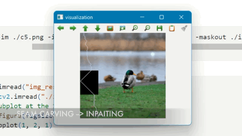

<!-- Banner -->
<p align="center">
  <a href="https://www.uit.edu.vn/" title="Trường Đại học Công nghệ Thông tin" style="border: none;">
    
  </a>
</p>

<h1 align="center"><b>THỊ GIÁC MÁY TÍNH</b></h>

## THÀNH VIÊN NHÓM

| STT    | MSSV          | Họ và Tên              | Github                                               | Email                   |
| ------ |:-------------:| ----------------------:|-----------------------------------------------------:|-------------------------:
| 1      | 20520781      | Lê Việt Thịnh          |     https://github.com/levietthinh                                           |20520781@gm.uit.edu.vn   |
| 2      | 20521597      | Đinh Nhật Minh         |https://github.com/Banhkun	                        |20521597@gm.uit.edu.vn   |
| 3      | 20520731      | Trần Thị Mỹ Quyên |https://github.com/AzaleaBrowns |20520731@gm.uit.edu.vn   |
| 4      | 20521424      | Văn Nguyễn Ngọc Huyền |https://github.com/ngochuynnuit |20521424@gm.uit.edu.vn   |


## GIỚI THIỆU MÔN HỌC

-   **Tên môn học:** Thị giác máy tính
-   **Mã môn học:** CS231
-   **Mã lớp:** CS232.M21
-   **Năm học:** HK2 (2021 - 2022)
-   **Giảng viên**: TS.Nguyễn Vĩnh Tiệp

## ĐỒ ÁN CUỐI KÌ

-   **Tên đề tài**: Object removal with Inpainting based on Seam Carving
-   **Giới thiệu**
    -   Thuật toán **Seam Carving** là một thuật toán hỗ trợ thay đổi kích thước hình ảnh mà không gây biến dạng vật thể chính, được giới thiệu trong bài báo khoa học của S. Avidan & A. Shamir.
    -   Thuật toán **Inpainting** là thuật toán hỗ trợ tác vụ loại bỏ đối tượng không mong muốn khỏi hình ảnh, chẳng hạn như con người, văn bản, cây cối…
    -   Đồ án này thực nghiệm kết hợp hai thuật toán tối ưu trên để giải quyết tác vụ xóa bỏ vật thể (Object Removal) trong hình ảnh.
-   **Hướng dẫn cài đặt**
    ```bash
      git clone https://github.com/Banhkun/Inpainting-with-seam-carving
      cd Inpainting-with-seam-carving
    ```
    To emulate our project, following our instruction in jupyter notebook:
    <h3 align="center">
        <a href="https://karhdo.github.io/CS231.M21/">DEMO</a>
    </h3>
    
